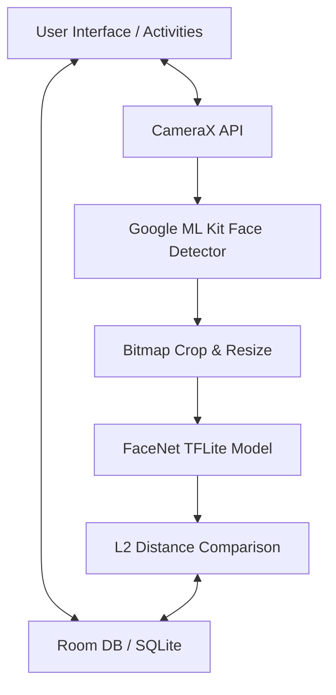
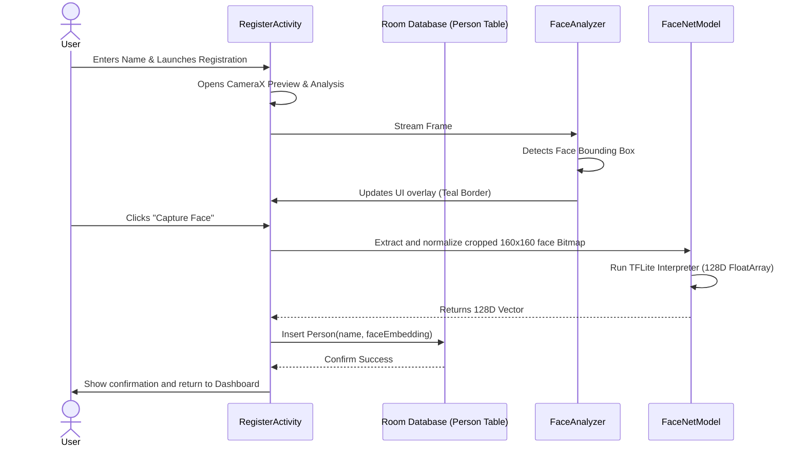
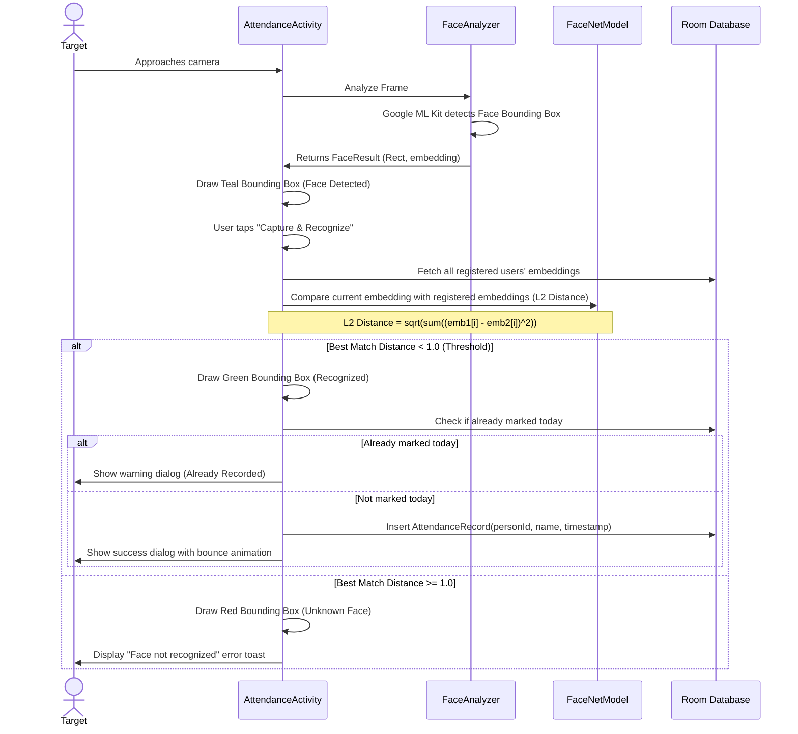
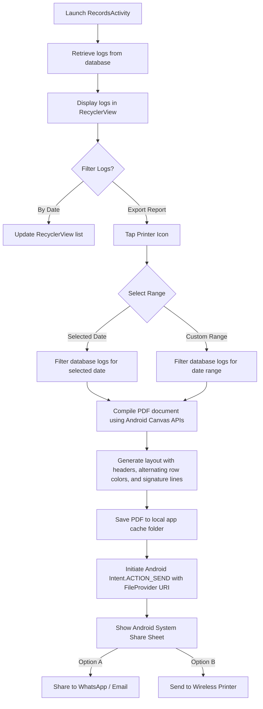

# AI Attendance System App Workflow

The **AI Attendance System** is an offline-first Android application that combines on-device machine learning with a local SQLite database (via Room) to track attendance. Below is a detailed breakdown of the application workflows, system architecture, data models, and the machine learning pipeline.

---

## 🗺️ System Architecture Overview

The application is structured into three core layers:
1. **Presentation (UI) Layer**: Handled by activities (`MainActivity`, `RegisterActivity`, `AttendanceActivity`, `RecordsActivity`, `RegisteredUsersActivity`) using **View Binding** and customized overlay rendering.
2. **Machine Learning Pipeline**: Uses **CameraX** for live image analysis, feeding frames to **Google ML Kit** for face boundary detection, then extracting the face, passing it to **FaceNet TFLite**, and L2 normalizing the outputs.
3. **Data Access Layer**: Uses a local **Room Database** containing two tables: `Person` (representing users and their 128D embeddings) and `AttendanceRecord` (representing logs).

---

## 🔄 Core Workflows

### 1. Face Registration Flow 👤

This flow registers a new user by capturing their face, generating a unique biometric embedding, and saving it to the SQLite database.

---

### 2. Take Attendance & Recognition Flow 🔍

This flow runs real-time camera analysis to detect and identify a face. If recognized, it saves a new attendance record.

---

### 3. Attendance Logs & PDF Report Generation Flow 🖨️

This workflow compiles selected logs into a professional PDF report on the local device, ready for wireless printing or sharing.

---

## 🧠 Machine Learning & Inference Pipeline

The core ML calculations happen locally using standard floating-point operations:

1. **Detection**: **Google ML Kit Face Detector** is configured with `PERFORMANCE_MODE_FAST` to run efficiently on mobile. It isolates the coordinates of the largest face in the current frame.
2. **Crop & Scale**: The system crops the face bounding box out of the full image bitmap, then resizes it to exactly **160 × 160 pixels** (FaceNet input size).
3. **Preprocessing**: The 160×160 RGB pixels are scaled and normalized to values between `[-1.0, 1.0]` using:
   $$\text{Normalized Value} = \frac{\text{Pixel Color Value} - 127.5}{127.5}$$
4. **Embedding Generation**: The normalized bitmap buffer is run through the `mobile_face_net.tflite` model, generating a `FloatArray` of size 128 (128-dimensional space representation of facial features).
5. **L2 Normalization**: The 128D embedding vector is normalized to unit length so that distance calculations are standardized.
6. **Matching**: The system compares the live face's embedding $A$ and a stored face's embedding $B$ using **L2 (Euclidean) distance**:
   $$d(A, B) = \sqrt{\sum_{i=1}^{128} (A_i - B_i)^2}$$
   * **Distance < 1.0**: Confirmed match.
   * **Distance >= 1.0**: Unrecognized/Unknown.

---

## 💾 Database Schema

The Room Database operates with two tables:

### 1. `Person` Table (Registered Users)
* `id` (Long, Primary Key, Auto-generate)
* `name` (String)
* `faceEmbedding` (FloatArray, converted to string/blob via TypeConverters for storage)
* `createdAt` (Long, timestamp)

### 2. `AttendanceRecord` Table (Logs)
* `id` (Long, Primary Key, Auto-generate)
* `personId` (Long, Foreign Key pointing to `Person.id` on delete CASCADE)
* `personName` (String, cached name)
* `timestamp` (Long, timestamp of attendance in milliseconds)
